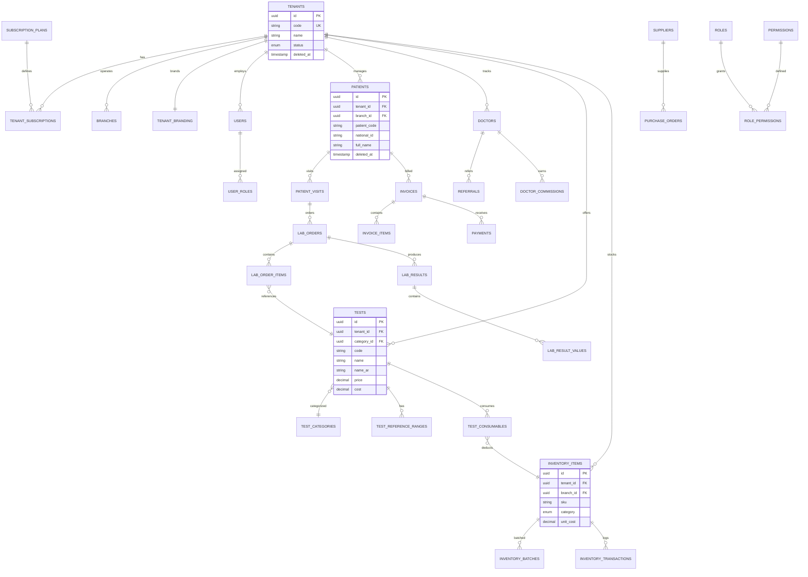
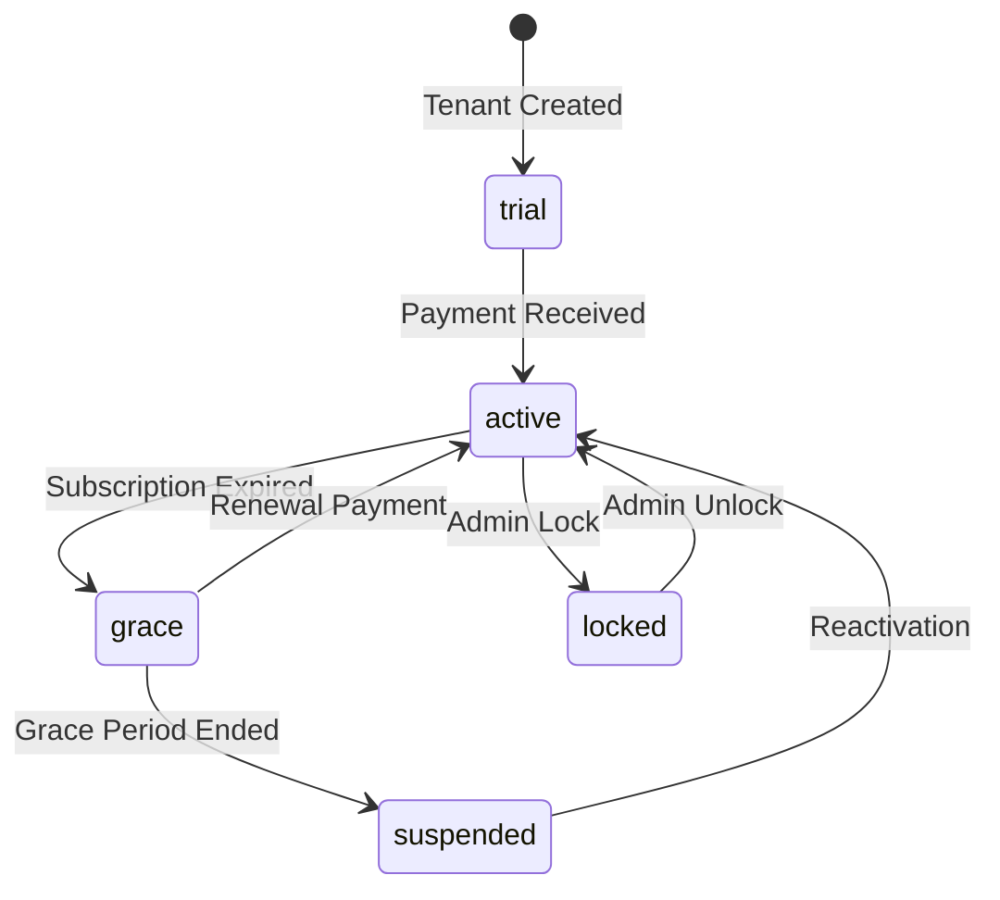

# LabMaster Egypt - Entity Relationship Diagram

## Architecture Overview

## Multi-Tenancy Strategy

- Every business table includes `tenant_id UUID NOT NULL` with FK to `tenants(id) ON DELETE CASCADE`
- API middleware validates tenant context via JWT + `X-Tenant-Id` header
- Soft delete via `deleted_at` column on all mutable entities
- Platform tables (`platform_users`, `subscription_plans`) have no tenant_id

## Index Strategy

| Table | Index | Purpose |
|-------|-------|---------|
| patients | (tenant_id, patient_code) UNIQUE | Code generation |
| patients | GIN on name, phone, national_id | Full-text search |
| audit_logs | (tenant_id, created_at DESC) | Audit trail queries |
| tenant_subscriptions | (expires_at) WHERE active | Renewal monitoring |
| inventory_batches | (expiry_date) WHERE qty > 0 | Expiry alerts |

## Subscription Lifecycle

